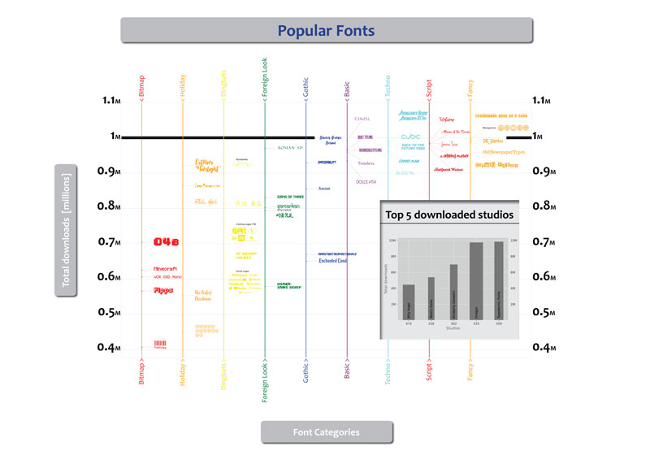
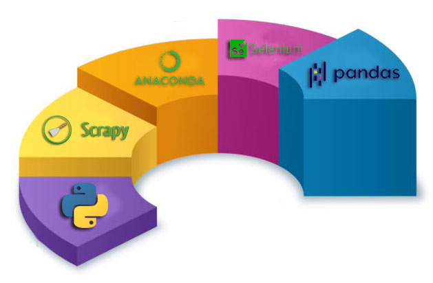

<h1>Data Science Project</h1>
<Aprill>Website scraping and data visualisation
 
Aprill 2020</h2>

Scraped data from Da Font site to see what fonts per category are the most popular and which studios are the most successful.

 
<a href="https://www.dafont.com/">Da Font website link </a>
  

<h2>Data scraping and visualisation outcome:</h2>

   

Achived with help: 

